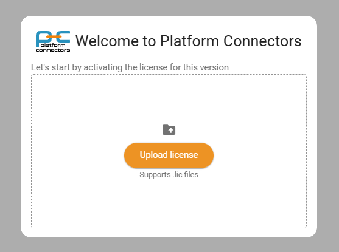

License
=======

You must have a valid license file before you can start using Platform Connectors. The application will not operate without one.

License scope and rules
-----------------------

The license file governs multiple aspects of usage:

1. Application Version
   - The license includes the application version you are entitled to run.
   - Upgrading the application to a major version requires obtaining an updated license first.Application patches and minor updates are allowed within the licensed major version.
2. Expiry
   - Demo licenses: limited, short‑term expiry (e.g. 30 days).
   - Standard licenses: No Expiry
3. Workstation Limit
   - The license includes a maximum number of workstation machines that can be registered.
   - Additional workstation capacity can be purchased per workstation and supplied via an updated license file.
4. Plugin Enablement
   - Only plugins listed in the license are enabled in the UI.
   - Individual plugins may include: (a) max instance count, (b) limits on items, connections, or transactions. See each plugin’s page for its specific limits.

Obtaining a license
-------------------

- Contact sales/support with required details (license number, desired plugins, workstation count).
- Receive a signed license file (e.g. ``pconn.lic``).

Applying a license (UI)
-----------------------

First-time activation happens immediately after you browse to the application for the first time.

1. Open ``http://localhost:8000`` (or your configured host/port).
2. A modal dialog appears prompting you to upload the license file (--file  ``.lic``).
3. Click **Upload** and select the file.
4. Once the onboarding is completed, you can check the license details by navigating to Settings.

Applying a updated license (after initial activation):

1. Navigate to Settings → Licensing.
2. Click **Update License**.
3. Upload the new license file (for added plugins or limits).
4. The page refreshes showing updated expiry, workstation quota, and plugins.

Workstation registration
------------------------

When a workstation first connects/registers, it consumes one slot from the license. To free a slot (for decommissioned machines), remove the workstation from the Settings page.

Plugin limits
-------------

Plugin pages document their specific limit semantics. Examples:

- "Instance limit": Maximum number of active plugin instances.
- "Item limit": Cap on items processed (records, devices, connections, etc.).

Next steps
----------

Register your first workstation: :doc:`workstation`.
