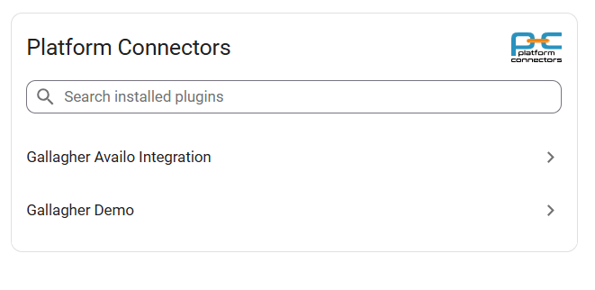

Plugins
=======

.. note::

   To start using a plugin, you need to set it up first. Navigate to (:doc:`/settings/plugins`) to configure your first plugin

Navigate to the plugins page using the "Dashboard" tab at the bottom of the page
Once you have at least one plugin configured you will see a list of installed plugins as shown below

Click on the plugin item to open the plugin view. You can use the search field to search for the plugin by name

Available plugins
-----------------

Select a plugin to see details, licensing, and configuration steps.

.. toctree::
   :maxdepth: 1

   gallagher-availo   
   gallagher-demo
   gallagher-bacnet-emulator
   gallagher-hikvision
