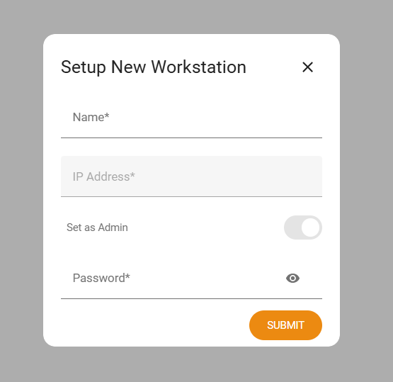

First Workstation Registration
==============================

The first machine you connect to Platform Connectors from must be registered as an admin workstation. This consumes one slot from your license.

.. note::

    You can start the onboarding from a different machine than the server host, but that machine must be able to reach the server over the network. At least 1 admin workstation is required to manage other workstations.

Registering a workstation
-------------------------

1.  Name: Provide a friendly name for the workstation (e.g. "Admin PC")
2.  IP Address: The IP address for the initial workstation is auto-detected. This field will be greyed out
3.  Set as Admin: The first workstation must be an admin. This field will be greyed out
4.  Password: Set a password for this workstation. This password will be used when navigating to the Settings page from this workstation.
5.  Click **SUBMIT** to complete the process.

Next steps
----------

After registration, proceed to plugin installation and configuration: :doc:`plugins/index`.